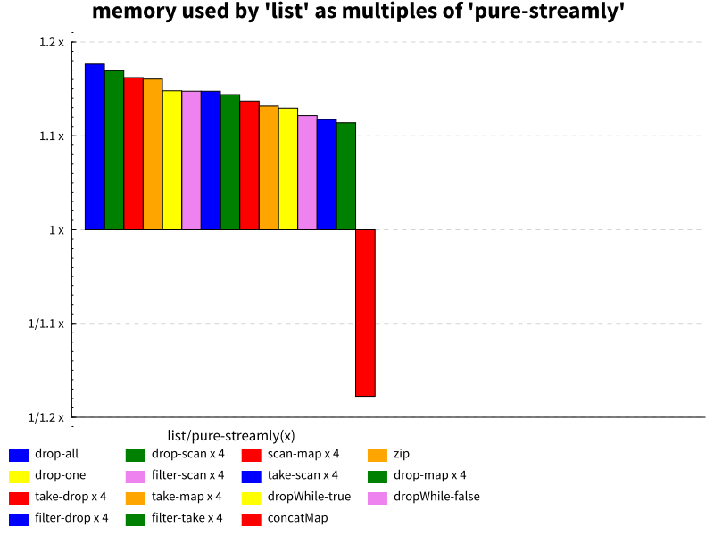
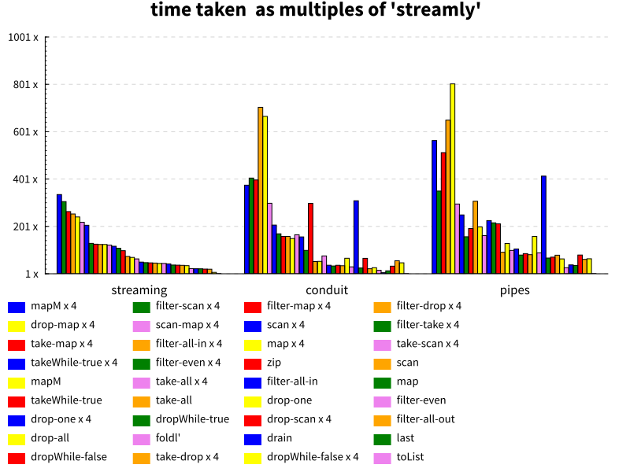
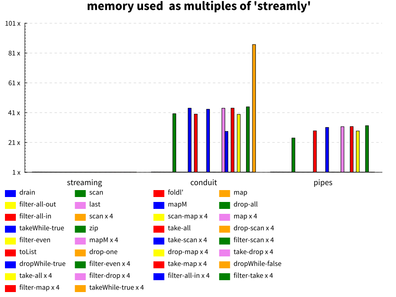

# Streaming Benchmarks

[](https://hackage.haskell.org/package/streaming-benchmarks)
[](https://gitter.im/composewell/streamly)
[](https://travis-ci.org/composewell/streaming-benchmarks)
[](https://ci.appveyor.com/project/harendra-kumar/streaming-benchmarks)

Compare the performance of various implementations of pure streams and monadic
streams in Haskell. Due care has been taken to keep the comparisons
fair.  Please send an email or a PR if the benchmarking code has a
problem or is unfair to some library in any way.

DISCLAIMER: This package is a result of benchmarking effort done during the
development of [Streamly](https://github.com/composewell/streamly) by the
authors of [Streamly](https://github.com/composewell/streamly).

## Benchmark Setup

A stream of one million consecutive numbers is generated and various stream
operations are applied on the stream.  The total time taken, and the maximum
resident set size (rss) is measured and plotted for each library.

Libraries are built with GHC-8.6.5. All benchmarks were run on an Apple MacBook
Pro computer with a 4-core 2.2 GHz Intel Core i7 processor and 16GB RAM.

## Benchmarks

* `drain`                  | Just discards all the elements in the stream
* `drop-all`               | drops all element using the ``drop`` operation
* `last`                   | extract the last element of the stream
* `fold`                   | sum all the numbers in the stream
* `map`                    | increments each number in the stream by 1
* `take-all`               | Use ``take`` to retain all the elements in the stream
* `filter-even`            | Use ``filter`` to keep even numbers and discard odd numbers in the stream.
* `scan`                   | scans the stream using ``+`` operation
* `mapM`                   | transform the stream using a monadic action
* `zip`                    | combines corresponding elements of the two streams together

In addition to basic operations like in the table above we also have benchmarks
with repeated application of the same operation e.g. `take-all x 4` means the
`take-all` operation is performed 4 times repeatedly. Similalrly we have composite
operations e.g. `take-map` is a `take` operation followed by a `map` operation.
Then we also have repeated composite operations e.g. `take-map x 4` is `take-map`
applied 4 times.

## Pure Streams

[Streamly](https://github.com/composewell/streamly) stream type `SerialT
Identity a` can be used as a pure stream replacing the standard Haskell list
type `[a]`. Using `OverloadedLists` GHC extension streamly can be used as an
almost drop-in replacement for lists. See
[Streamly.List](https://github.com/composewell/streamly/blob/master/src/Streamly/List.hs)
module for more details.

The following figures show the ratio of time and memory consumed by `[Int]`
(`base-4.12`) vs `SerialT Identity Int`
([streamly@00c7613](https://github.com/composewell/streamly)) for exactly the
same operation. `5x` on the y axis means lists take 5 times more resources
compared to streamly. Whereas a `1/5x` means that lists take 5 times less
resources compared to streamly. We only show those operations that are at least
10% better or worse in one library compared to the other. The operations are
shown in a sorted order, from list's worst performing ones on the left to its
best ones on the right.




See [full details on timing and memory utilization of all operations benchmarked here](charts-0/streamly-vs-list.txt)

Streamly uses stream fusion whereas lists use foldr/build fusion. The reason
why streamly performs much better than lists for repeated operations could be
because of better fusion. It is also possible that something needs to be fixed
in lists. We hope that these results will lead to some investigation and fixing
of the libraries we measured.

## Monadic Streams

The following figures show how many times cpu cycles and memory some other
streaming libraries take, as compared to
([streamly@00c7613](https://github.com/composewell/streamly)). `10x` on the
y-axis means that the given library and operation takes 10x time to complete
the operation as compared to streamly. We have plotted monadic streaming
libraries `streaming-0.2.2.0`, `conduit-1.3.1.1` and `pipes-4.3.10`. We
excluded `machines` from the graphs to keep it more readable because it shows
even worse performance pushing the range in the graph to become even wider.

Note that these are micro-benchmarks and the actual performance gains in a
macro benchmark would depend on the type of application and where it is
spending most of its time.




See [full details on timing and memory utilization of all operations benchmarked here](charts-0/streamly-vs-streams.txt)

## How to Run

To quickly compare packages:

```
# Show help
$ ./bench.sh --help

# Use --measure to run the benchmarks, remove that option if you just want to
# change the report/graph options and do not want to run the benchmarks.
# Use --fast for quick results when trying

# Compare a given list of packages. Use `--help` for available package names.
$ ./bench.sh --measure --fast --benchmarks "streamly,streaming,pipes"

# Show diff
$ ./bench.sh --diff multiples --benchmarks "streamly,streaming"
$ ./bench.sh --diff percent --benchmarks "streamly,streaming"

# Show absolute values instead of diff
$ ./bench.sh --benchmarks "streamly,streaming"

# Generate graphs (.svg) instead of textual comparison
$ ./bench.sh --diff multiples --benchmarks "streamly,streaming" --graphs
```

## Adding New Libraries

It is trivial to add a new package. This is how 
[a benchmark file](https://github.com/composewell/streaming-benchmarks/blob/master/Benchmarks/Streamly.hs)
for a streaming package looks like. Pull requests are welcome, we will be happy
to help, [just join the gitter chat](https://gitter.im/composewell/streamly)
and ask!

## Benchmarking Notes

* Memory once requested from the OS is never released back to the OS by `GHC`.
  This may lead to false `maxrss` reporting when there are multiple benchmarks in
  the same benchmark recipe file. We run each benchmark in an isolated
  process to avoid that. The `bench.sh` script takes care of this, running the
  benchmark executable directly may not give correct results if all benchmarks
  are run together.
* Running benchmarks in isolation also ensures avoiding any other kind of
  interference (e.g. unwanted sharing) among benchmarks. Though this may not
  be able to avoid any compile time interference.
* We have tried to optimize (`INLINE` etc.) each library's code as much as we
  could, library authors are encouraged to take a look at if their library is
  being used in a fully optimized manner and report if there are any issues.
