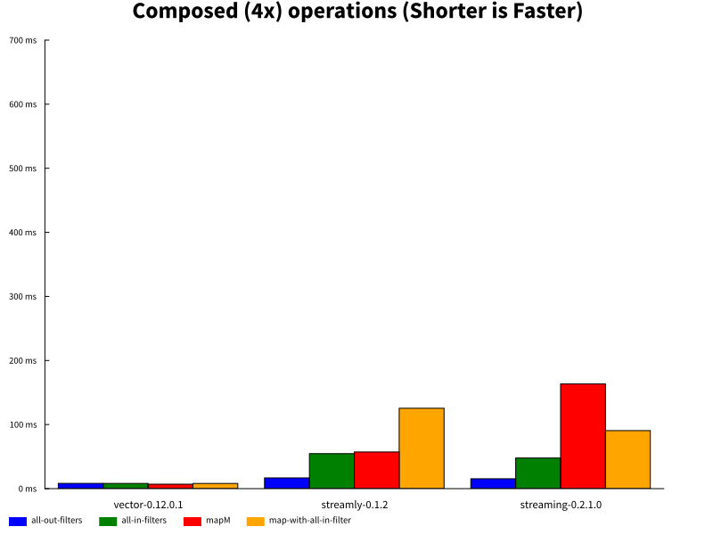
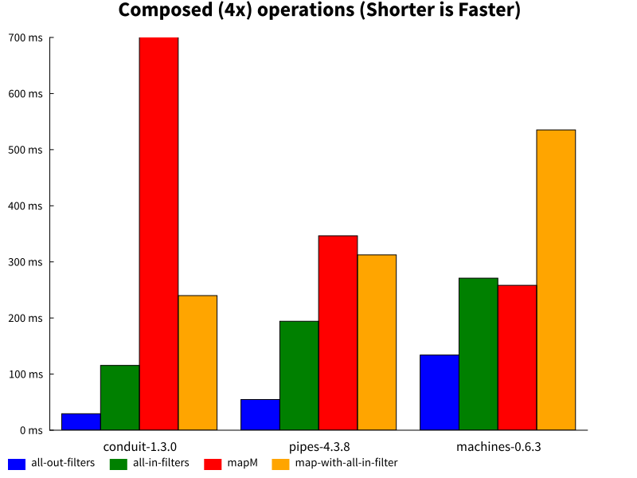
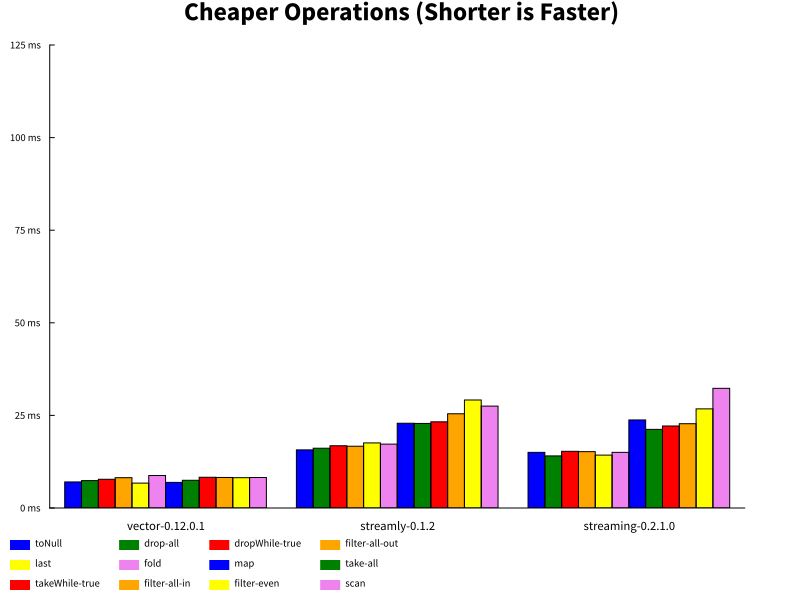
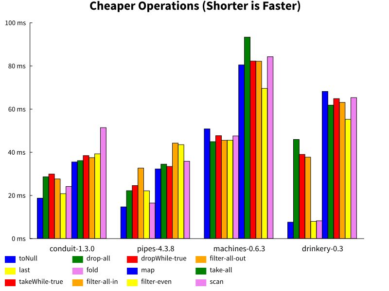
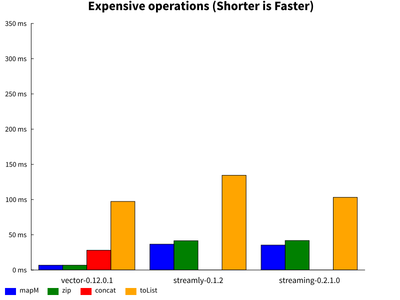
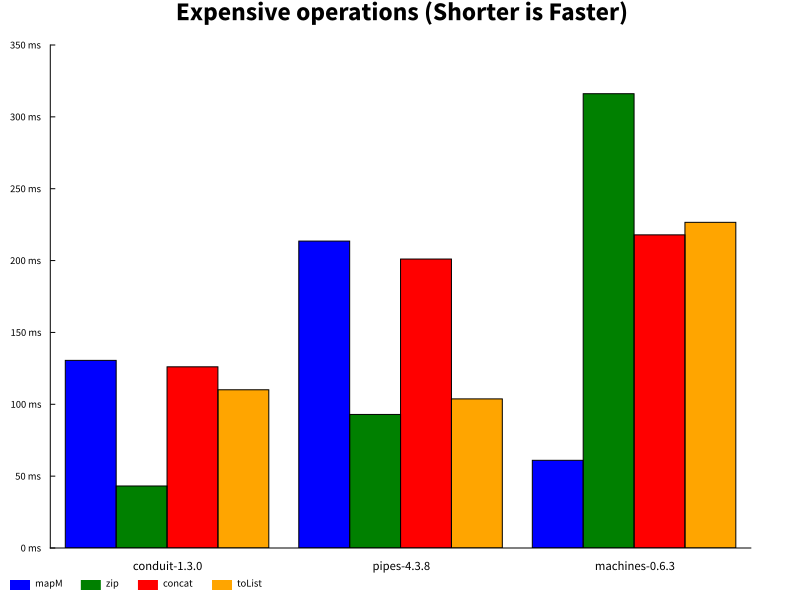

Streaming Benchmarks
====================

.. image:: https://badges.gitter.im/composewell/gitter.svg?
  :target: https://gitter.im/composewell/streamly
  :alt: Gitter chat

.. image:: https://img.shields.io/hackage/v/streaming-benchmarks.svg?style=flat
  :target: https://hackage.haskell.org/package/streaming-benchmarks
  :alt: Hackage

.. image:: https://travis-ci.org/composewell/streaming-benchmarks.svg?branch=master
  :target: https://travis-ci.org/composewell/streaming-benchmarks
  :alt: Unix Build Status

.. image:: https://ci.appveyor.com/api/projects/status/8d1kgrrw9mmxv5xt?svg=true
  :target: https://ci.appveyor.com/project/harendra-kumar/streaming-benchmarks
  :alt: Windows Build status

.. contents:: Table of Contents
   :depth: 1

Comprehensive, carefully crafted benchmarks for streaming operations and their
comparisons across notable Haskell streaming libraries including `vector`,
`streaming`, `machines`, `pipes`, `conduit` and `streamly`. `Streamly
<https://github.com/composewell/streamly>`_ is a new streaming library with
beautiful high level and composable concurrency built-in, it is the primary
motivation for these benchmarks.  We have put a lot of effort to make sure that
the benchmarks are correct, fair and reproducible.  Please report if you find
something that is not right.

See below to find out how to run the benchmarks yourself and compare your
favorite streaming packages. It is trivial to add a new package. This is how `a
benchmark file
<https://github.com/composewell/streaming-benchmarks/blob/master/Benchmarks/Streamly.hs>`_
for a streaming package looks like. Pull requests are welcome, I will be happy
to help, `just join the gitter chat
<https://github.com/composewell/streaming-benchmarks/blob/master/Benchmarks/Streamly.hs>`_
and ask!

Benchmarks
----------

In all the benchmarks we work on a stream of a million consecutive numbers. The
benchmarks use the IO Monad for running the operations. There are three
categories of graphs:

* Composing an operation four times in a pipeline; measures composition
  efficiency
* Individual operations are divided into two categories for clarity of graphs:

  * Relatively cheaper operations
  * More expensive operations

Composing Pipeline Stages
~~~~~~~~~~~~~~~~~~~~~~~~~

+------------------------+----------------------------------------------------+
| Benchmark              | Description                                        |
+========================+====================================================+
| mapM                   | ``mapM`` four times in a row                       |
+------------------------+----------------------------------------------------+
| all-in-filters         | four filters in a row,                             |
|                        | each allowing all elements in                      |
+------------------------+----------------------------------------------------+
| all-out-filters        | four filters in a row, each blocking all elements  |
+------------------------+----------------------------------------------------+
| map-with-all-in-filter | ``map`` followed by ``filter`` composed four times |
|                        | serially                                           |
+------------------------+----------------------------------------------------+

|composed1| |composed2|

Commentary
^^^^^^^^^^

* The composed ``mapM`` for ``streaming`` is more expensive than ``streamly``
  even though the cost of the individual operation is the same for both
  libraries.

* A composed ``mapM`` has an unusally high cost for ``conduit`` and ``pipes``
  which is in line with the cost of individual ``mapM`` being unusually high
  for these libraries.

Cheaper Operations
~~~~~~~~~~~~~~~~~~

These charts show micro-benchmarks for less costly streaming operations for a
quick comparison. Operations are ordered more or less by increasing cost for
better visualization. If an operation is not present in a library then an empty
space is displayed instead of a colored bar in its slot. See the following
sections for details about what the benchmarks do.

+------------------------+----------------------------------------------------+
| Benchmark              | Description                                        |
+========================+====================================================+
| toNull                 | Just discards all the elements in the stream       |
+------------------------+----------------------------------------------------+
| drop-all               | drops all element using the ``drop`` operation     |
+------------------------+----------------------------------------------------+
| dropWhile-true         | drops all element using an always ``True``         |
|                        | predicate with ``dropWhile``                       |
+------------------------+----------------------------------------------------+
| filter-all-out         | Discards all the elements in the stream using      |
|                        | ``filter``                                         |
+------------------------+----------------------------------------------------+
| last                   | extract the last element of the stream             |
+------------------------+----------------------------------------------------+
| fold                   | sum all the numbers in the stream                  |
+------------------------+----------------------------------------------------+
| map                    | increments each number in the stream by 1          |
+------------------------+----------------------------------------------------+
| take-all               | Use ``take`` to retain all the elements in the     |
|                        | stream                                             |
+------------------------+----------------------------------------------------+
| takeWhile-true         | Use ``takeWhile`` with an always ``True``          |
|                        | predicate                                          |
+------------------------+----------------------------------------------------+
| filter-all-in          | Use ``filter`` with a predicate that retains all   |
|                        | elements in the stream                             |
+------------------------+----------------------------------------------------+
| filter-even            | Use ``filter`` to keep even numbers and discard    |
|                        | odd numbers in the stream.                         |
+------------------------+----------------------------------------------------+
| scan                   | scans the stream using ``+`` operation             |
+------------------------+----------------------------------------------------+

|cheap1| |cheap2|

Commentary
^^^^^^^^^^

* ``toNull``, ``filter-all-in`` and ``filter-even`` seem to be an anomaly for
  ``pipes``, perhaps some low hanging opitmization can help.

Expensive Operations
~~~~~~~~~~~~~~~~~~~~

More expensive operations are charted separately to have shorter range in the
charts for better clarity.

+------------------------+----------------------------------------------------+
| Benchmark              | Description                                        |
+========================+====================================================+
| mapM                   | transform the stream using a monadic action        |
+------------------------+----------------------------------------------------+
| zip                    | combines corresponding elements of the two streams |
|                        | together                                           |
+------------------------+----------------------------------------------------+
| concat                 | turn a stream of containers into a stream of their |
|                        | elements                                           |
+------------------------+----------------------------------------------------+
| toList                 | convert the stream to a list                       |
+------------------------+----------------------------------------------------+

|expensive1| |expensive2|

Commentary
^^^^^^^^^^

* ``mapM`` and ``zip`` should not be in the expensive category, they are not
  very expensive for ``vector``, ``streamly``, and ``streaming``. They are here
  because ``mapM`` is unusually expensive for ``conduit`` (20x of vector) and
  ``pipes`` (30x of vector), and ``zip`` is unusally expensive for ``machines``
  (46x of vector). Perhaps they can use some optimization for these.
* The ``concat`` operation for ``streaming`` hangs forever, it may be a bug in
  the library. ``concat`` is not yet available in streamly.

Caveats
~~~~~~~

When choosing a streaming library to use we should not be over obsessed about
the performance numbers as long as the performance is within reasonable bounds.
Whether the absolute performance or the differential among various libraries
matters or not may depend on your workload. If the cost of processing the data
is significantly higher compared to the streaming overhead then the difference
may not matter at all; unless you are performing huge number of tiny
operations, performance difference may not be significant.

How to Run
----------

::

  ./run.sh

After running you can find the charts generated in the ``charts`` directory.

Comparing Selected Packages
~~~~~~~~~~~~~~~~~~~~~~~~~~~

If you want to compare just two or three packages you can do that too.

::

  ./run.sh -- -m pattern vector
  ./run.sh --append -- -m pattern streamly
  ./run.sh --append -- -m pattern streaming

These commands will keep appending benchmark data and the newly benchmarked
package will get added in the charts every time you run the command. To start
fresh again remove the ``--append`` option.

Quick Mode
~~~~~~~~~~

If you are impatient use ``./run.sh --quick`` and you will get the results much
sooner though a tiny bit less precise. Note that quick mode won't generate the
graphs unless the yet unreleased version of ``gauge`` from github repo is used.

Pedantic Mode
~~~~~~~~~~~~~

Note that if different optimization flags are used on different packages,
performance can sometimes badly suffer because of GHC inlining and
specialization not working optimally.  If you  want to be absolutely sure that
all packages and dependencies are compiled with the same optimization flags
(``-O2``) use ``run.sh --pedantic``, it will install the stack snapshot in a
private directory under the current directory and build them fresh with the ghc
flags specified in ``stack-pedantic.yaml``. Be aware that this will require 1-2
GB extra disk space.

Benchmarking Notes
------------------

Benchmarking is a tricky business. Though the benchmarks have been carefully
designed there may still be issues with the way benchmarking is being done or
the way they have been coded. If you find that something is being measured
unfairly or incorrectly please bring it to our notice by raising an issue or
sending an email or via gitter chat.

Measurement
~~~~~~~~~~~

``Benchmarking Tool:`` We use the `gauge
<https://github.com/vincenthz/hs-gauge>`_ package instead of criterion.  We
spent a lot of time figuring out why benchmarking was not producing accurate
results. Criterion had several bugs due to which results were not reliable. We
fixed those bugs in ``gauge``. For example due to GC or CAF evaluation
interaction across benchmarks, the results of benchmarks running later in the
sequence were sometimes totally off the mark. We fixed that by running each
benchmark in a separate process in gauge. Another bug caused criterion to
report wrong mean.

``Measurement iterations:`` We pass a million elements through the streaming
pipelines. We do not rely on the benchmarking tool for this, it is explicitly
done by the benchmarking code and the benchmarking tool is asked to perform
just one iteration. We added fine grained control in `gauge
<https://github.com/vincenthz/hs-gauge>`_ to be able to do this.

Benchmarking Code
~~~~~~~~~~~~~~~~~

* ``IO Monad:`` We run the benchmarks in the IO monad so that they are close to
  real life usage. Note that most existing streaming benchmarks use pure code
  or Identity monad which may produce entirely different results.

* Unless you do some real IO operation, the operation being benchmarked can get
  completely optimized out in some cases. We use a random number generation in
  the IO monad and feed it to the operation being benchmarked to avoid that
  issue.

* The efficiency of the code generating a stream may affect all performance
  numbers of a library because this is a constant cost involved in all the
  benchmarks. That is also the reason why elimination operations are in general
  faster than transformation operations because the benchmarks for latter
  include elimination cost as well.

GHC Inlining
------------

* ``Inlining:`` GHC simplifier is very fragile and inlining may affect the
  results in unpredictable ways unless you have spent enough time scrutinizing
  and optimizing everything carefully.  Inlining is the biggest source of
  fragility in performance benchmarking. It can easily result in an order of
  magnitude drop in performance just because some operation is not correctly
  inlined. Note that this applies very well to the benchmarking code as well.

* ``GHC Optimization Flags:`` To make sure we are comparing fairly we make sure
  that we compile the benchmarking code, the library code as well as all
  dependencies using exactly the same GHC flags. GHC inlining and
  specialization optimizations can make the code unpredictable if mixed flags
  are used. See the ``--pedantic`` option of the ``run.sh`` script.

* ``Single file vs multiple files`` The best way to avoid issues is to have
  all the benchmarking code in a single file. As soon as the code was split
  into multiple files, performance of some libraries dropped, in some cases by
  3-4x.  Careful sprinkling of INLINE pragmas was required to bring it back to
  original. Even functions that seemed just 2 lines of code were not
  automatically inlined.

* When all the code was in a single file, not a single INLINE pragma was
  needed. But when split in multiple files even functions that were not
  exported from that file needed an INLINE pragma for equivalent performance.
  This is something that GHC may have to look at.

* The effect of inlining varied depending on the library.  To make sure that we
  are using the fully optimized combination of inline or non-inline for each
  library we carefully studied the impact of inlining individual operations for
  each package.  The study can be found here.

* There is something magical about streamly, not sure what it is. Even though
  all other libraries were impacted significantly for many ops, streamly seemed
  almost unaffected by splitting the benchmarking ops into a separate file! If
  we can find out why is it so, we could perhaps understand and use GHC
  inlining in a more predictable manner.

* This kind of unpredictable non-uniform impact of moving functions in
  different files shows that we are at the mercy of the GHC simplifier and
  always need to tune performance carefully after refactoring, to be sure that
  everything is fine. In other words, benchmarking and optimizing is crucial
  not just for the libraries `but for the users of the libraries as well`.
