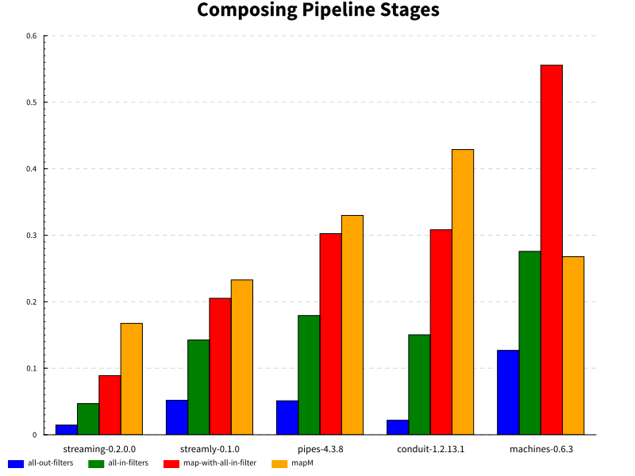
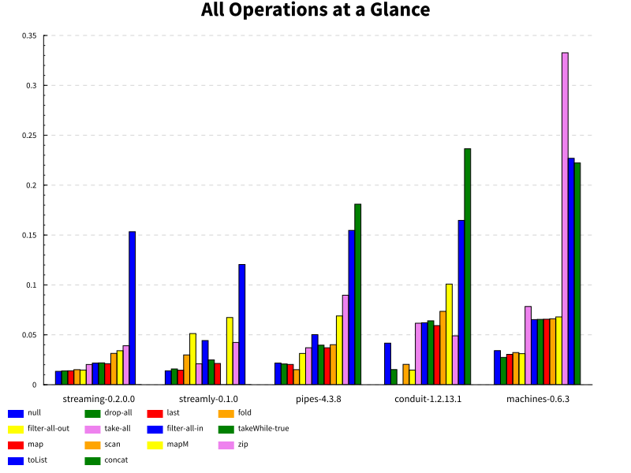
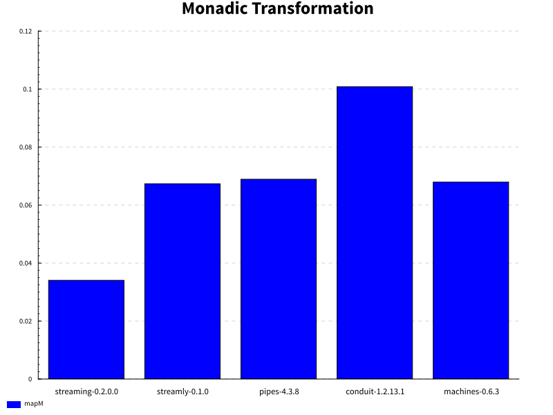
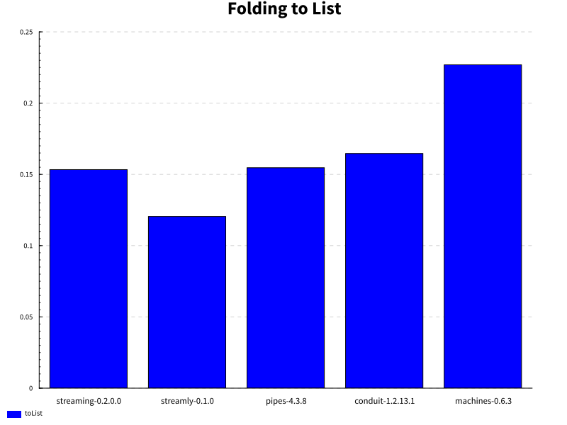

.. image:: https://badges.gitter.im/composewell/gitter.svg?
  :target: https://gitter.im/composewell/streamly
  :alt: Gitter chat

.. image:: https://img.shields.io/hackage/v/streaming-benchmarks.svg?style=flat
  :target: https://hackage.haskell.org/package/streaming-benchmarks
  :alt: Hackage

.. image:: https://travis-ci.org/composewell/streaming-benchmarks.svg?branch=master
  :target: https://travis-ci.org/composewell/streaming-benchmarks
  :alt: Unix Build Status

.. image:: https://ci.appveyor.com/api/projects/status/8d1kgrrw9mmxv5xt?svg=true
  :target: https://ci.appveyor.com/project/harendra-kumar/streaming-benchmarks
  :alt: Windows Build status

Streaming Benchmarks
====================

Comprehensive, carefully crafted benchmarks for streaming operations and their
comparisons across notable Haskell streaming libraries including `vector`,
`streaming`, `machines`, `pipes`, `conduit` and `streamly`. `Streamly
<https://github.com/composewell/streamly>`_ is a new streaming library with
beautiful high level and composable concurrency built-in, it is the primary
motivation for these benchmarks.  We have put a lot of effort to make sure that
the benchmarks are correct, fair and reproducible.  Please report if you find
something that is not right.

See below to find out how to run the benchmarks yourself and compare any
selected streaming packages. It is trivial to add a new package. This is how `a
benchmark file
<https://github.com/composewell/streaming-benchmarks/blob/master/Benchmarks/Streamly.hs>`_
for a streaming package looks like. Pull requests are welcome, I will be happy
to help, `just join the gitter chat
<https://github.com/composewell/streaming-benchmarks/blob/master/Benchmarks/Streamly.hs>`_
and ask!

Benchmarks & Results
--------------------

In all the benchmarks we work on a stream of a million consecutive numbers. We
start the sequence using a random number between 1 and 1000 and enumerate it to
make a total of a million elements using the streaming library's native
sequence enumeration API.

Caveats
~~~~~~~

Note that, these benchmarks show results for conduit-1.3.0 which is a recently
released major version, it perhaps requires some work to get at par with the
earlier version.  conduit-1.2.13.1 `showed significantly better performance
<https://github.com/composewell/streaming-benchmarks/blob/269ac94fc59c76267b89b07690d9ea290096b95b/charts/AllOperationsataGlance.svg>`_
compared to the newer version.  If you  know there is an issue in the way
conduit or any other package is being measured please point out.

When choosing a streaming library to use we should not be over obsessed about
the performance numbers as long as the performance is within reasonable bounds.
Whether the absolute performance or the differential among various libraries matters
or not may depend on your workload. If the cost of processing the data is
significantly higher then the streaming operations' overhead will just pale in
comparison and may not matter at all. Unless you are performing huge number of
tiny operations, performance difference may not be significant.

Composing Pipeline Stages
~~~~~~~~~~~~~~~~~~~~~~~~~

These benchmarks compare the performance when multiple operations are composed
serially in a pipeline. This is how the streaming libraries are supposed to be
used in real applications.

The `mapM` benchmark introduces four stages of `mapM` between the source and
the sink.

`all-in-filters` composes four stages of a `filter` operation that passes all
the items through.  Note that passing or blocking nature of the filter may
impact the results. Some libraries can do blocking more optimally by short
circuiting.

`all-out-filters` composes four stages of a `filter` operation that `blocks`
all the items i.e. does not let anything pass through.

The `map-with-all-in-filter` benchmark introduces four identical stages between
the source and the sink where each stage performs a simple `map` operation
followed by a `filter` operation that passes all the items through.

Individual Operations
~~~~~~~~~~~~~~~~~~~~~

This chart shows micro-benchmarks for all individual streaming operations for a
quick comparison. Operations are ordered more or less by increasing cost for
better visualization. If an operation is not present in a library then an empty
space is displayed instead of a colored bar in its slot. See the following
sections for details about what the benchmarks do.

Elimination Operations
^^^^^^^^^^^^^^^^^^^^^^

This chart shows the cheapest of all operations, they include operations that
iterate over the stream and either discard all the elements or fold them to a
single value. They all do similar stuff and are generally expected to have
similar cost.  Benchmarks include:

* `toNull:` Just discards all the elements in the stream.
* `drop-all`: drops ``n`` elements from the stream where ``n`` is set to the
  length of the stream.
* `last`: drops all the elements except the last one.
* `fold`: adds all the elements in the stream to produces the sum.

.. image:: charts/Discarding and Folding.svg
  :alt: Discarding and Folding

Transformation and Filtering
^^^^^^^^^^^^^^^^^^^^^^^^^^^^

This is the next category which is a bit costlier than the previous one. Unlike
previous category these operations inspect the elements in the stream and
form a transformed stream based on a function on the value. Benchmarks include:

* `filter-all-out`: A filter that discards all the elements in the stream.
* `filter-all-in`: A filter that retains all the elements in the stream.
* `take-all`: take `n` elements from the stream where `n` is set to the length
  of the stream. Effectively iterates through the stream and retains all of it.
* `takeWhile-true`: retains all elements of the stream using a condition that
  always evaluates to true.
* `map`: A pure transformation that increments each element by 1.
* `filter-even`: A filter that passes even elements in the stream i.e. half the
  elements are kept and the other half discarded.
* `scan`: scans the stream using ``+`` operation.

.. image:: charts/Pure Transformation and Filtering.svg
  :alt: Pure Transformation and Filtering

Monadic Transformation
^^^^^^^^^^^^^^^^^^^^^^

This benchmark compares the monadic transformation of the stream using
``mapM``.

Folding to List
^^^^^^^^^^^^^^^

This benchmark compares folding the stream to a list.

Zip and Concat
^^^^^^^^^^^^^^

Zip combines corresponding elements of the two streams together. Concat turns a
stream of containers into a stream of their elements.

.. image:: charts/Zipping and Concating Streams.svg
  :alt: Zipping and Concating Streams

How to Run
----------

::

  ./run.sh

After running you can find the charts generated in the ``charts`` directory.

Comparing Selected Packages
~~~~~~~~~~~~~~~~~~~~~~~~~~~

If you want to compare just two or three packages you can do that too.

::

  ./run.sh -- -m pattern vector
  ./run.sh --append -- -m pattern streamly
  ./run.sh --append -- -m pattern streaming

These commands will keep appending benchmark data and an additional packages
will appear in the charts every time you run the command. To start fresh again
remove the `--append` option.

Quick Mode
~~~~~~~~~~

If you are impatient use ``./run.sh --quick`` and you will get the results much
sooner though a tiny bit less precise. Note that quick mode won't generate the
graphs unless the yet unreleased version of ``gauge`` from github repo is used.

Pedantic Mode
~~~~~~~~~~~~~

Note that if different optimization flags are used on different packages,
performance can sometimes badly suffer because of GHC inlining and
specialization not working optimally.  If you  want to be absolutely sure that
all packages and dependencies are compiled with the same optimization flags
(``-O2``) use ``run.sh --pedantic``, it will install the stack snapshot in a
private directory under the current directory and build them fresh with the ghc
flags specified in ``stack-pedantic.yaml``. Be aware that this will require 1-2
GB extra disk space.

Benchmarking Notes
------------------

Benchmarking is a tricky business. Though the benchmarks have been carefully
designed there may still be issues with the way benchmarking is being done or
the way they have been coded. If you find that something is being measured
unfairly or incorrectly please bring it to our notice by raising an issue or
sending an email or via gitter chat.

Measurement
~~~~~~~~~~~

``Benchmarking Tool:`` We use the `gauge
<https://github.com/vincenthz/hs-gauge>`_ package instead of criterion.  We
spent a lot of time figuring out why benchmarking was not producing accurate
results. Criterion had several bugs due to which results were not reliable. We
fixed those bugs in ``gauge``. For example due to GC or CAF evaluation
interaction across benchmarks, the results of benchmarks running later in the
sequence were sometimes totally off the mark. We fixed that by running each
benchmark in a separate process in gauge. Another bug caused criterion to
report wrong mean.

``Measurement iterations:`` We pass a million elements through the streaming
pipelines. We do not rely on the benchmarking tool for this, it is explicitly
done by the benchmarking code and the benchmarking tool is asked to perform
just one iteration. We added fine grained control in `gauge
<https://github.com/vincenthz/hs-gauge>`_ to be able to do this.

Benchmarking Code
~~~~~~~~~~~~~~~~~

* ``IO Monad:`` We run the benchmarks in the IO monad so that they are close to
  real life usage. Note that most existing streaming benchmarks use pure code
  or Identity monad which may produce entirely different results.

* ``GHC Optimization Flags:`` To make sure we are comparing fairly we make sure
  that we compile the benchmarking code, the library code as well as all
  dependencies using exactly the same GHC flags. GHC inlining and
  specialization optimizations can make the code unpredictable if mixed flags
  are used. See the ``--pedantic`` option of the ``run.sh`` script.

* ``Inlining:`` GHC simplifier is very fragile and inlining may affect the
  results in unpredictable ways unless you have spent enough time scrutinizing
  and optimizing everything carefully. The best way to avoid issues is to have
  all the benchmarking code in a single file. As soon as the code was split
  into multiple files, performance of some libraries dropped, in some cases by
  3-4x.  Careful sprinkling of INLINE pragmas was required to bring it back to
  original. Even functions that seemed just 2 lines of code were not
  automatically inlined.

* ``Issues due to Optimizations?:`` In some cases we saw ridiculously low
  results, may be due to some trivial optimizations. To avoid that we tried
  using random numbers in the IO monad and pass those through the pipeline
  rather than using some constant or predictable source, it helped but we are
  still not sure of root cause of the issue. Also there is a yet unknown issue
  that makes the code to just get completely optimized out even when using
  `nfIO`, and the results will be nanoseconds.  I added a workaround for this
  issue but need to figure out the exact cause of that. Both of these issues
  may be related.

* The efficiency of the code generating a stream may affect all performance
  numbers of a library because this is a constant cost involved in all the
  benchmarks.

Observations
------------

* `Streamly` and `streaming` are the fastest (faster than `vector`) when
  more than one operation is composed together.  This is a very important
  benchmark as this is a quite common case in practical programming.
* Vector is the fastest in individual operations.
* Vector, streamly and streaming can do almost all operations in similar amount
  of time. In general elimination operations are the fastest and transformation
  are slightly slower.
* pipes/conduit and machines can do elimination operations quite fast, almost
  at the same speed as streamly and streaming, but they are significantly slower
  at transformation operations. There may be some optimization opportunity
  there or it may be a fundamental characterization of that design category.
* When the operations being benchmarked are defined in a separate file conduit
  and pipes are even slower. This is almost always the case in non-trivial
  programs as they cannot be written in a single file. This could be due to GHC
  not being able to inline them as well as it can inline others?
* There is something magical about streamly, not sure what it is. Even though
  all other libraries were impacted significantly for many ops, streamly seemed
  almost unaffected by splitting the benchmarking into a separate file! If we
  can find out why is it so, we could perhaps find some formula to keep
  performance predictable.
